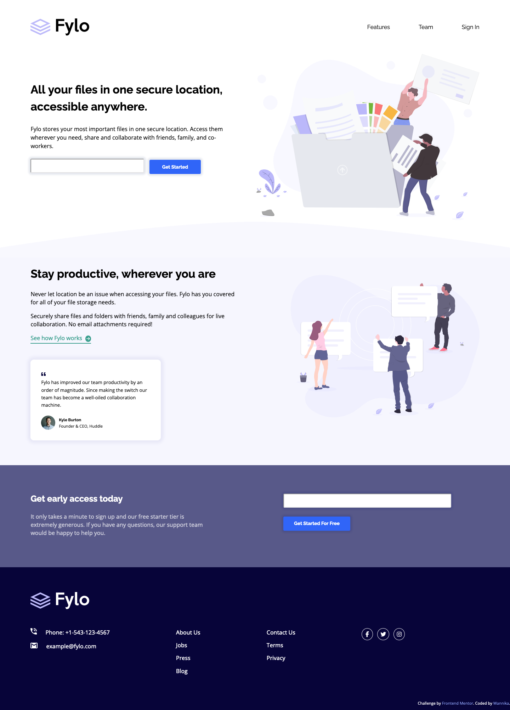

# Frontend Mentor - Fylo landing page with two column layout solution

This is a solution to the [Fylo landing page with two column layout challenge on Frontend Mentor](https://www.frontendmentor.io/challenges/fylo-landing-page-with-two-column-layout-5ca5ef041e82137ec91a50f5). Frontend Mentor challenges help you improve your coding skills by building realistic projects. 

## Table of contents

- [Overview](#overview)
  - [The challenge](#the-challenge)
  - [Screenshot](#screenshot)
  - [Links](#links)
- [My process](#my-process)
  - [Built with](#built-with)
  - [What I learned](#what-i-learned)
- [Author](#author)

## Overview

### The challenge

Users should be able to:

- View the optimal layout for the site depending on their device's screen size
- See hover states for all interactive elements on the page

### Screenshot

Desktop

Mobile - active

### Links

- Solution URL: [GitHub repo](https://github.com/Wannika123/fem-landingPage1)
- Live Site URL: [GitHub page](https://wannika123.github.io/fem-landingPage1/)

## My process

### Built with

- Semantic HTML5 markup
- CSS custom properties
- Flexbox
- jQuery !!!!!!

### What I learned

I learn that CSS is frustrating. This is also the first project that I use jQuery.

## Author

- Frontend Mentor - [@Wannika123](https://www.frontendmentor.io/profile/Wannika123)
